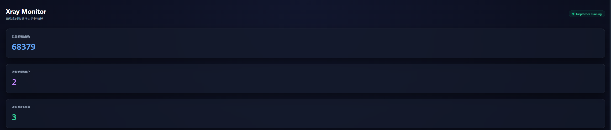

# XRAY-MONITOR 🚀

一个轻量的 Xray/Marzban 行为日志实时透视大屏。支持全局入站/出站热度分流饼图，多设备流量混淆排查工具。

由 Go (Fiber) + Vue 3 (Vite + ECharts) 驱动，通过 GitHub Actions 自动编译，支持跨平台一键容器化私密部署。

基于Marzaban二次开发。

使用美国豆包+codex编译。


### 若需要监控多个服务器，建议单独配置一个总控机，使用Tailscale构建大内网，把所需监控的数据机纳入，随后总控机使用Nginx，不同后缀来访问。

---
## 🛠️ 1. Marzban 面板配置 (数据源)

修改 Marzban 核心配置文件（通常位于 `/var/lib/marzban/xray_config.json`），将 `log` 字段严格调整为：

```json
"log": {
  "loglevel": "info",
  "access": "/var/lib/marzban/xray_access.log",
}
```

💡 提示：修改完成后，重启 Marzban 面板以激活日志输出。

## 🐳 2. 服务器一键部署指令

## 🚨 严重安全警告：下面的配置直接使用会导致10000端口向公网暴露，最后给出了解决方案。

在Debian/Ubuntu 服务器上，复制并执行：

### 安装 Docker Compose 依赖
```
sudo apt update -y
sudo apt install docker.io docker-compose-plugin -y
sudo systemctl enable --now docker
```

### 创建并切入目录
```
sudo mkdir -p /opt/xray-monitor && cd /opt/xray-monitor
```

### 下载配置
```
sudo cat << 'EOF' > docker-compose.yml
services:
  xray-monitor:
    image: ghcr.io/glareglimmering/marzbananalysis:latest
    container_name: xray-monitor
    restart: always
    ports:
      - "10000:10000"
    volumes:
      # ⚠️️️⚠️️️⚠️️️ 注意：请确保宿主机此路径下确实存在该日志文件，否则 Docker 会把它误建为文件夹
      - /var/lib/marzban/xray_access.log:/var/lib/marzban/xray_access.log:ro
      - ./data:/app/store/data
    environment:
      - TZ=Asia/Shanghai
EOF
```

### 拉起服务
```
sudo docker compose up -d
```

## 🔒 3. Cloudflare Tunnel 私密访问配置
推荐使用 Cloudflare Tunnel 进行无公网端口暴露的安全穿透与鉴权访问。

强烈推荐开启零信任模式。

---

## 其他指令

**查看运行状态**  
```
cd /opt/xray-monitor
docker ps | grep xray-monitor
```

**重启服务**
```
cd /opt/xray-monitor
docker compose restart || docker-compose restart
```

**停止并关闭**
```
cd /opt/xray-monitor
docker compose down || docker-compose down
```

**升级到最新版**
```
cd /opt/xray-monitor && \
git pull && \
docker compose pull && \
docker compose up -d --force-recreate && \
docker image prune -f
```

# 🚨 严重安全警告：上面的配置直接使用会导致10000端口向公网暴露

docker越过了ufw，导致10000向公网开放，如果修改docker，过程比较折磨，推荐下述方案

### 🛠️ 全自动修复方案

**在端口映射时，显式绑死内网 IP（如 Tailscale / 局部局域网 IP）**，物理绝缘公网。

请立刻修改 `docker-compose.yml`：

```
nano /opt/xray-monitor/docker-compose.yml
```

```yaml
services:
  xray-monitor:
    image: ghcr.io/...
    ports:
      # ❌ 错误示范
      # - "10000:10000" 

      #  正确示范：绑定tailscale内网ip，物理隔离，不用折腾防火墙
      - "100.92.50.78:10000:10000"
```
随后重新拉起容器
```
cd /opt/xray-monitor
docker compose up -d --force-recreate
```
